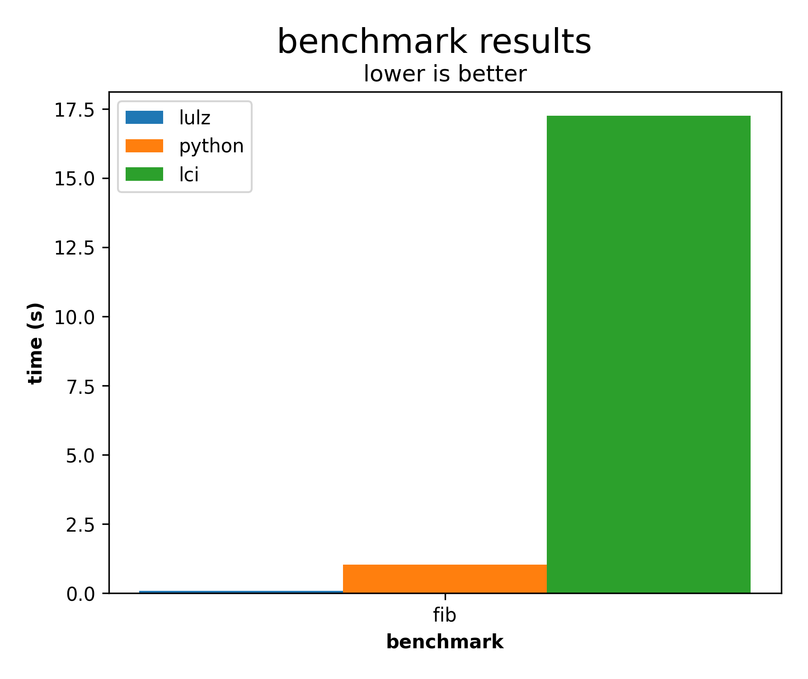

# lulz

[](https://crates.io/crates/lulz)

`lulz` is a **[LOLCODE](http://www.lolcode.org/) implemented** written in rust.
It is **much faster than [lci](https://github.com/justinmeza/lci)** because it embeds **Lua**
as a JIT-compiler backend.

**also, it...**

- won't give you random **segfaults** like [lci](https://github.com/justinmeza/lci/issues/55)
  [does](https://github.com/justinmeza/lci/issues/54)
  [a](https://github.com/justinmeza/lci/issues/47)
  [lot](https://github.com/justinmeza/lci/issues/49)
- tries very hard to conform to the [**LOLCODE spec**](https://github.com/justinmeza/lolcode-spec), 
  with some additional (backwards compatible) features
- has beautiful and informative **rust/clang-like-errors**

this implementation is still a work in progress, and some [tests](./tests/) still don't pass yet.

## running

```bash
cargo install lulz
lulz --help
```

## build from source

```bash
git clone https://github.com/MonliH/lulz.git
cd lulz
cargo run --release
```

## how fast??

In a simple [recursive fibonacci benchmark](./perfs/fib/fib.lol), it performs about **220x** faster than lci, and **13x** faster than CPython:

</img>

I will add more benchmarks soon. Note: The startup times of each implementation is included in the timings. Benchmarks performed on a AMD Ryzen 7 5700U.

To run the benchmarks yourself:

```bash
# Install dependencies:
pip install matplotlib numpy tqdm
cargo install hyperfine
# Show help menu:
python run_perfs.py --help
```

## run tests

```bash
python run_tests.py
```
